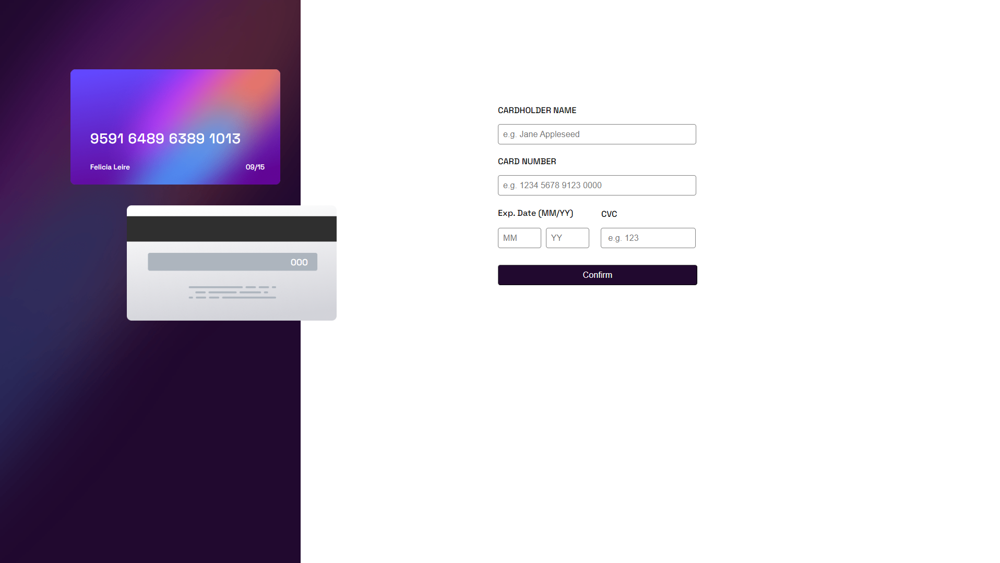

# Interactive Card Details

The **Interactive Card Details** application is a web-based tool designed to help users input and manage their credit card information securely and interactively. This app allows users to see their card details in a visually appealing format, enhancing the user experience while ensuring essential information is easy to read.

## Table of Contents

1. [Overview](#overview)
2. [Technologies Used](#technologies-used)
3. [Features](#features)
4. [Getting Started](#getting-started)
5. [Usage](#usage)

## Overview

The **Interactive Card Details** application provides a simple and intuitive interface for users to enter their credit card details, including card number, expiration date, and cardholder name. The app instantly displays the entered information on an interactive card design, allowing users to preview how their card will look while ensuring they input valid data.

### Project status: `Completed`

This project is fully functional, and feedback for enhancements is always appreciated.

## Screenshots

Here’s how the **Interactive Card Details** app looks in action:



*Screenshot description: A visually appealing interactive card interface where users can input card details, and see real-time updates on the card display.*

## Technologies Used

This app is built using the following technologies:

- **HTML5**: For structuring the web page.
- **CSS3**: For styling the user interface with modern designs.
- **JavaScript (ES6)**: For implementing the interactive logic and validation of card details.

## Features

- Interactive display of card details that updates in real-time as users input data.
- Input validation to ensure correct formats for card numbers and expiration dates.
- Responsive design that works seamlessly on both desktop and mobile devices.
- Clear instructions and feedback messages to guide users through the input process.

## Getting Started

### Prerequisites

To run this project locally, you only need a modern web browser.

### Installation

1. Clone this repository to your local machine:
   ```bash
   git clone https://github.com/AndreiAlin1/Interactive-card-details.git

2. Navigate to the project folder:
   cd Interactive-card-details

3. Open the index.html file in your browser to start using the app:
   open index.html

### Usage:
  1. Enter your cardholder name in the provided input field.
  2. Fill in your card number using the number input.
  3. Select the expiration date using the dropdown menus.
  4. As you fill in the details, watch the card display update in real-time.
  5. Ensure all fields are filled out correctly before submission for optimal results.